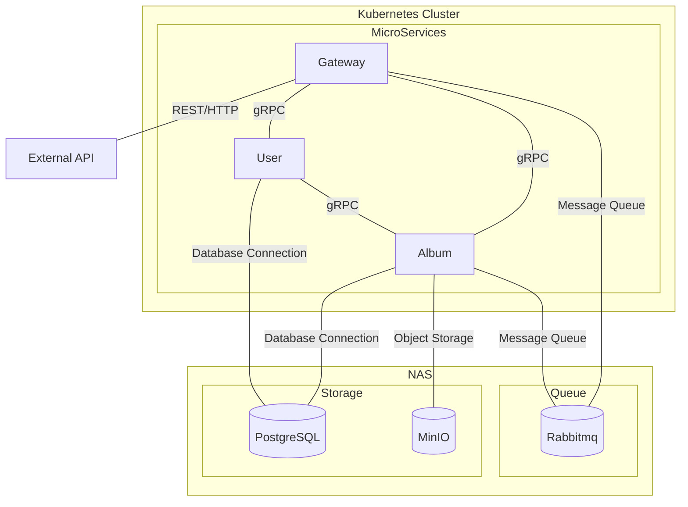

### Hatongsu backend

##### TODO

- 환경변수값 typescript 처리

##### Protocol buffers

```bash
sudo apt install -y protobuf-compiler
protoc --version

protoc --plugin=./node_modules/.bin/protoc-gen-ts_proto \
--ts_proto_out=./libs/common/src/grpc \
--ts_proto_opt=nestJs=true,addGrpcMetadata=true \
./proto/album.proto
```

##### Architecture



##### TODO

- Gallery Spot 고도화 작업

  - 현재는 dateTimeOriginal DESC 로 상위 10개만 리턴
  - GallerySpotEntity 를 이용하여 관리자가 갤러리 노출 이미지를 관리할 수 있도록 수정

- utc 적용

  - 현재 postgres 는 'Asia/seoul' 로 되어있는 상태
  - typeorm timezone 'z' 를 통해 create_at, update_at 은 utc 로 저장
  - date 타입으로 변환시 db에 로컬타임으로 저장되는 것을 방지하기 위해 타임존 정보 제거후 저장
  - 핸드폰 등 exif 정보는 로컬타임으로 들어올까? 확인후 utc 저장방식 체크해보기

- NODE_TLS_REJECT_UNAUTHORIZED 이거 없이 인증서 신뢰 어떻게 해야하는지 확인해보기
- production db migration 세팅하기
- cursor 에서 ISO 변환이 꼭 필요한 것인가?
- prod 직접 푸쉬는 가능한데... on: pull_request 안넣어서 그런가? 테스트 해보기
