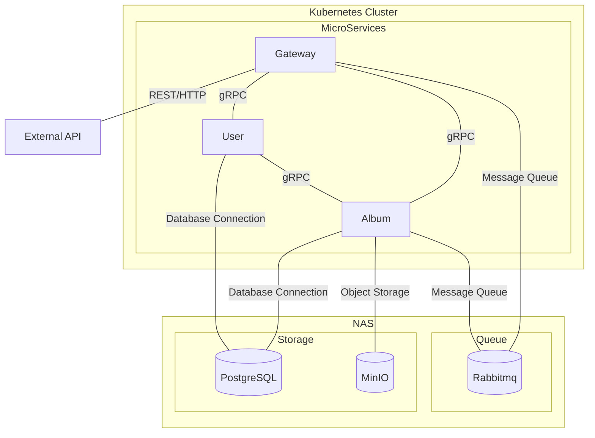

### Hatongsu backend

##### TODO

- 환경변수값 typescript 처리

##### Protocol buffers

```bash
sudo apt install -y protobuf-compiler
protoc --version

protoc --plugin=./node_modules/.bin/protoc-gen-ts_proto \
--ts_proto_out=./libs/common/src/grpc \
--ts_proto_opt=nestJs=true,addGrpcMetadata=true \
./proto/album.proto
```

##### Architecture



##### TODO

- cursor 에서 ISO 변환이 꼭 필요한 것인가?
