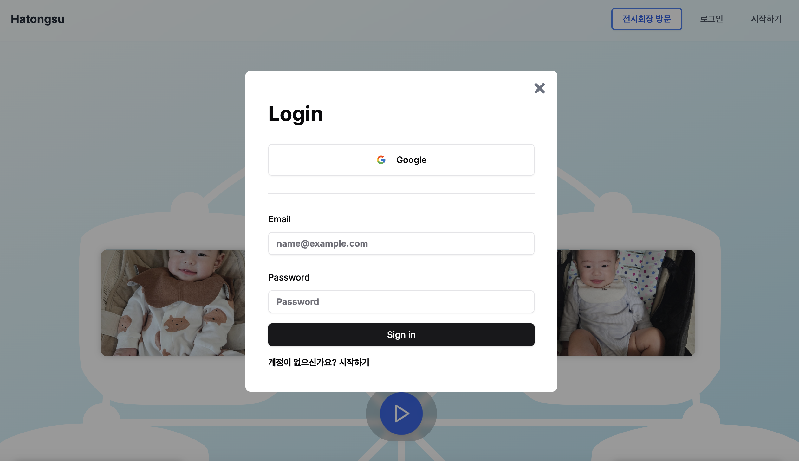
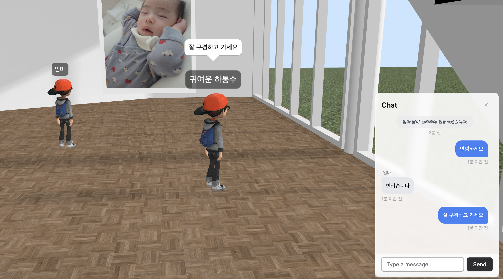

# Hatongsu Backend

## Demo

[https://practice-zzingo.net](https://practice-zzingo.net)

## Architecture

- HTTPS: 웹 서비스 엔드포인트 및 API 통신
- WebRTC: 실시간으로 캐릭터 위치/회전 정보를 Low latency로 동기화
- WebSocket: 갤러리 내 실시간 채팅을 위한 양방향 통신
- RabbitMQ: 대량의 이미지 업로드 요청을 안정적으로 처리하기 위한 메시지 큐 시스템
- gRPC: 백엔드 마이크로서비스간 Protocol Buffers를 활용한 효율적인 데이터 전송

## Screenshot

  <h3>메인 페이지</h3>
  

    
    
  

  
  <h3>3D 갤러리</h3>
  

    
    
  

  <h3>대시보드</h3>
  

    
    
  

## Features

- [x] NestJS를 사용하여 마이크로서비스 구축
- [x] gRPC를 이용한 마이크로 서비스간 통신 구현
- [x] 클린 아키텍처 패턴 적용을 통해 코드 가독성 및 테스트 용이성 향상
- [x] TypeORM을 활용하여 데이터베이스 관리 및 ORM 기반 CRUD API 개발
- [x] JWT를 이용한 인증 시스템 구현

## My Project

|                                                 [Frontend](https://github.com/zzingobomi/hatongsu-frontend)                                                  |                                                 [Backend](https://github.com/zzingobomi/hatongsu-backend)                                                 |                                                   [World Server](https://github.com/zzingobomi/hatongsu-world-server)                                                    |                                                   [Event Server](https://github.com/zzingobomi/hatongsu-event-server)                                                    |                                              [Infra](https://github.com/zzingobomi/on-premise)                                              |
| :----------------------------------------------------------------------------------------------------------------------------------------------------------: | :-------------------------------------------------------------------------------------------------------------------------------------------------------: | :----------------------------------------------------------------------------------------------------------------------------------------------------------------------: | :----------------------------------------------------------------------------------------------------------------------------------------------------------------------: | :-----------------------------------------------------------------------------------------------------------------------------------------: |
|  |  |  |  |  |
